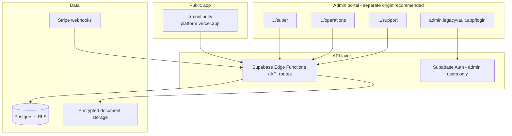

# LegacyVault — Backend & 3-Tier Admin Portal Design

This document defines how the **backend** and **admin portal** should be structured for [Lifr Continuity Platform](https://lifr-continuity-platform.vercel.app), with **three admin levels**, separate URLs from the public app, and clear permissions.

---

## 1. High-level architecture



| Layer | Technology (recommended) | Purpose |
|--------|---------------------------|---------|
| Public frontend | Current HTML/React on Vercel | Subscribers & visitors |
| Admin frontend | Next.js or React SPA on **separate Vercel project** | Staff only; never mixed with public bundle |
| API | Supabase Edge Functions + Postgres RPC | Business logic, audit logs |
| Auth | Supabase Auth (`app_metadata.admin_role`) | Separate admin user pool from subscribers |
| Payments | Stripe | Subscriptions, Last Wish video add-ons |
| Files | Supabase Storage (private buckets) | Wills, legal docs (encrypted client-side where possible) |

**Important:** Admin accounts must **not** use the same login table/flow as subscribers without strict role separation. Store role in `app_metadata` (server-only), never `user_metadata`.

---

## 2. Three admin levels

### Level 1 — Super Admin (`super_admin`)

**Who:** Platform owner, CTO, compliance officer (limited count: 1–3 accounts).

**Purpose:** Full control of platform, security, billing configuration, and other admins.

| Area | Permissions |
|------|-------------|
| Dashboard | Global KPIs: MRR, active subs, churn, trigger events, storage usage |
| Subscribers | View / edit / suspend / delete / impersonate (with audit) |
| Subscriptions & billing | Plans, coupons, Stripe sync, refunds, Last Wish add-on pricing |
| Will enquiries | View all; assign; export |
| Content | FAQ, pricing copy, email templates |
| Security | RLS audit, API keys (rotate), MFA policy, session revoke all |
| Admins | Create / disable **Operations** and **Support** users; never delete last super admin |
| Audit | Full immutable audit log (all actions, all admins) |
| System | Feature flags, maintenance mode, data retention jobs |

---

### Level 2 — Operations Admin (`operations_admin`)

**Who:** Operations manager, billing specialist, senior support lead.

**Purpose:** Day-to-day subscriber and revenue operations **without** platform security or super-admin management.

| Area | Permissions |
|------|-------------|
| Dashboard | Ops KPIs: new signups, plan mix, failed payments, open Will enquiries |
| Subscribers | View / edit profile, change plan, extend grace, cancel (no hard delete) |
| Subscriptions | Upgrade/downgrade, apply credits, Last Wish video add-ons |
| Will enquiries | View, assign, update status, call notes (400 383 3707 workflow) |
| Support tickets | Full access to Customer Support bot escalations |
| Affiliates | View referrals, approve payouts (if enabled) |
| Audit | Read logs for own team + subscriber-facing actions |
| **Denied** | Create admins, Stripe secrets, RLS, impersonate without approval, delete subscriber vault data |

---

### Level 3 — Support Agent (`support_agent`)

**Who:** Front-line support, Will guidance staff.

**Purpose:** Help subscribers with questions and Will enquiries; **read-mostly** on sensitive vault content.

| Area | Permissions |
|------|-------------|
| Dashboard | Queue: open Will enquiries, recent chats, MFA lockouts |
| Subscribers | Search by email/name; view **non-vault** profile (plan, status, last check-in) |
| Will enquiries | View, reply, mark contacted; link to Contact Us submissions |
| Customer Support | View live bot transcripts; add internal notes |
| Subscriptions | **Read-only** plan and billing status |
| Audit | Own actions only |
| **Denied** | View document contents, assets, trusted people details, triggers, refunds, plan changes, any admin user management |

---

### Permission matrix (summary)

| Action | Super | Operations | Support |
|--------|:-----:|:----------:|:-------:|
| Manage admin users | ✅ | ❌ | ❌ |
| Stripe / plan config | ✅ | ⚠️ limited | ❌ |
| Refunds | ✅ | ✅ | ❌ |
| Change subscriber plan | ✅ | ✅ | ❌ |
| View vault documents | ✅ | ⚠️ with reason + audit | ❌ |
| Will enquiry workflow | ✅ | ✅ | ✅ |
| Impersonate subscriber | ✅ | ⚠️ approval | ❌ |
| Full audit log | ✅ | Team + subs | Self only |

---

## 3. Separate admin portal URLs

Use a **dedicated admin host** so the public site never loads admin code and cookies stay isolated.

### Recommended production URLs

| Environment | Admin portal base | Public app |
|-------------|-------------------|------------|
| Production | `https://admin.legacyvault.app` | `https://lifr-continuity-platform.vercel.app` |
| Staging | `https://admin-staging.legacyvault.app` | `https://staging.lifr-continuity-platform.vercel.app` |
| Local | `http://localhost:3001` | `http://localhost:3000` |

> **Vercel setup:** Create a second Vercel project `legacyvault-admin` pointing to `/admin` app folder, attach domain `admin.legacyvault.app`.

### Route map (single admin app, role-gated)

All staff sign in at one login; after auth, redirect by role.

| URL path | Who can access | Screen |
|----------|----------------|--------|
| `/login` | Everyone (unauthenticated) | Admin email + password + MFA |
| `/forgot-password` | Everyone | Reset flow |
| `/super` | `super_admin` only | Super Admin dashboard home |
| `/super/admins` | `super_admin` | Admin user CRUD |
| `/super/security` | `super_admin` | Security & compliance |
| `/super/billing` | `super_admin` | Stripe & plan configuration |
| `/super/audit` | `super_admin` | Full audit log |
| `/operations` | `super_admin`, `operations_admin` | Operations dashboard home |
| `/operations/subscribers` | Super, Operations | Subscriber list & detail |
| `/operations/subscriptions` | Super, Operations | Plans, changes, add-ons |
| `/operations/will-enquiries` | Super, Operations, Support | Will creation queue |
| `/operations/affiliates` | Super, Operations | Affiliate program |
| `/support` | All three roles | Support dashboard home |
| `/support/enquiries` | All three | Will + contact enquiries |
| `/support/subscribers` | All three | Limited subscriber lookup |
| `/support/chat` | All three | Escalated bot conversations |
| `/unauthorized` | Wrong role | “You don’t have access” |
| `/account` | All authenticated admins | Profile, MFA, sign out |

### Optional: bookmarkable tier URLs (marketing / training)

These redirect to the correct home after login if the user has that role:

- `https://admin.legacyvault.app/super` → Level 1 home  
- `https://admin.legacyvault.app/operations` → Level 2 home  
- `https://admin.legacyvault.app/support` → Level 3 home  

If a Support Agent opens `/super`, show `/unauthorized` and log the attempt.

### What NOT to use

| Avoid | Why |
|-------|-----|
| `lifr-continuity-platform.vercel.app/admin` on same deploy as public | Shared cookies, larger attack surface, admin bundle in public repo |
| Role in `user_metadata` | User-editable; unsafe for RLS |
| One URL with no role check | Support could hit super routes by guessing paths |

---

## 4. Backend data model (core tables)

```text
-- Subscribers (public app users)
profiles
  id uuid PK → auth.users
  full_name, email, country, language
  subscription_status, plan (basic|premium|family)
  stripe_customer_id
  last_check_in_at, account_status

subscriptions
  id, profile_id, plan, status, period_start/end
  last_wish_video_count, stripe_subscription_id

-- Vault data (RLS: owner only; admin via audited RPC)
assets, legal_documents, trusted_people, digital_assets
estate_planner_sections, custom_categories
last_wish_videos (metadata only; file in storage)

-- Admin
admin_profiles
  id uuid PK → auth.users (separate sign-up disabled; invite only)
  email, display_name
  role enum: super_admin | operations_admin | support_agent
  is_active, last_login_at

admin_invites
  email, role, token_hash, expires_at, invited_by

-- Operations
will_enquiries
  id, profile_id nullable, name, email, phone, message
  status: new | contacted | closed
  assigned_to admin_id, notes, source (contact_form|generate_will)

support_conversations
  id, profile_id nullable, messages jsonb, escalated boolean

-- Compliance
audit_logs
  id, actor_admin_id, actor_role, action, resource_type, resource_id
  ip, user_agent, metadata jsonb, created_at  -- append-only

trigger_events
  id, profile_id, stage, disclosed_at, ...
```

**RLS principle:** Subscribers never read `admin_*` tables. Admins never read vault tables directly from the client; use **Edge Functions** with service role + server-side permission checks + audit row per access.

---

## 5. API surface (backend endpoints)

Prefix: `https://<project-ref>.supabase.co/functions/v1/` or `https://api.legacyvault.app/v1/`

| Endpoint | Methods | Min role |
|----------|---------|----------|
| `/admin/auth/session` | GET | authenticated admin |
| `/admin/dashboard/metrics` | GET | support+ (scoped metrics) |
| `/admin/subscribers` | GET, PATCH | operations+ |
| `/admin/subscribers/:id/impersonate` | POST | super only |
| `/admin/subscriptions/:id/refund` | POST | operations+ |
| `/admin/will-enquiries` | GET, PATCH | support+ |
| `/admin/admins` | GET, POST, PATCH | super only |
| `/admin/audit` | GET | super (full), operations (filtered) |
| `/webhooks/stripe` | POST | signature only (no admin) |

Public app continues to use subscriber-scoped Supabase client + RLS.

---

## 6. Admin UI wireframe (by level)

### Super Admin — `/super`

```
┌─────────────────────────────────────────────────────────────┐
│ LegacyVault Admin · Super Admin          [Account] [Sign out]│
├──────────┬──────────────────────────────────────────────────┤
│ Overview │  MRR · Active subs · Churn · Storage · Triggers   │
│ Admins   │  [Table: admin users + invite]                    │
│ Billing  │  Plans · Stripe · Last Wish $6.99 config          │
│ Security │  Sessions · MFA policy · API health               │
│ Audit    │  [Searchable immutable log]                       │
│ All subs │  → link to /operations/subscribers                │
└──────────┴──────────────────────────────────────────────────┘
```

### Operations Admin — `/operations`

```
┌─────────────────────────────────────────────────────────────┐
│ LegacyVault Admin · Operations           [Account] [Sign out]│
├──────────┬──────────────────────────────────────────────────┤
│ Overview │  Signups today · Failed payments · Open enquiries │
│ Subscribers│ [Search] [Plan] [Status] → detail drawer        │
│ Billing  │  Plan changes · Refunds · Last Wish add-ons       │
│ Will queue│  [Kanban: New | Contacted | Closed]              │
│ Affiliates│  Referrals · Payouts                              │
└──────────┴──────────────────────────────────────────────────┘
```

### Support Agent — `/support`

```
┌─────────────────────────────────────────────────────────────┐
│ LegacyVault Admin · Support              [Account] [Sign out]│
├──────────┬──────────────────────────────────────────────────┤
│ My queue │  Will enquiries assigned to me                    │
│ Search   │  Subscriber lookup (plan/status only)             │
│ Enquiries│  All open Will + Contact Us tickets                 │
│ Chat     │  Escalated Customer Support bot threads           │
└──────────┴──────────────────────────────────────────────────┘
```

---

## 7. Auth flow

1. Admin visits `https://admin.legacyvault.app/login`.
2. Supabase Auth (email + password); enforce MFA for `super_admin` and `operations_admin`.
3. JWT includes `app_metadata: { admin_role: "operations_admin" }`.
4. Admin app reads role → redirect:
   - `super_admin` → `/super`
   - `operations_admin` → `/operations`
   - `support_agent` → `/support`
5. Every API call sends JWT; Edge Function validates role against required minimum.

---

## 8. Implementation phases

| Phase | Deliverable |
|-------|-------------|
| **1** | Supabase project, `profiles`, `subscriptions`, Stripe webhook |
| **2** | `admin_profiles`, invite-only admin auth, `/login` + role redirect |
| **3** | `/support` — Will enquiries + subscriber lookup |
| **4** | `/operations` — subscribers, plans, refunds |
| **5** | `/super` — admin CRUD, audit, security |
| **6** | Custom domain `admin.legacyvault.app` on Vercel |

---

## 9. Quick reference — URLs to share with your team

| Role | Bookmark after login |
|------|----------------------|
| Super Admin | https://admin.legacyvault.app/super |
| Operations Admin | https://admin.legacyvault.app/operations |
| Support Agent | https://admin.legacyvault.app/support |
| Login (all) | https://admin.legacyvault.app/login |

Until the admin app is deployed, add DNS + Vercel domain when ready. The public site stays at **https://lifr-continuity-platform.vercel.app**.

---

## 10. Related public features (backend hooks)

Map existing UI to backend ownership:

| Public feature | Backend module | Admin visibility |
|----------------|----------------|------------------|
| Generate Will? + 400 383 3707 | `will_enquiries` | All levels (Support owns queue) |
| Customer Support bot | `support_conversations` | Support + Operations |
| Premium/Family Last Wish video | `subscriptions` + Stripe line items | Operations + Super |
| Trusted People / vault | Encrypted storage + RLS | Super only (audited); Support denied |

---

*Document version: 1.0 — for LegacyVault / Lifr Continuity Platform*
